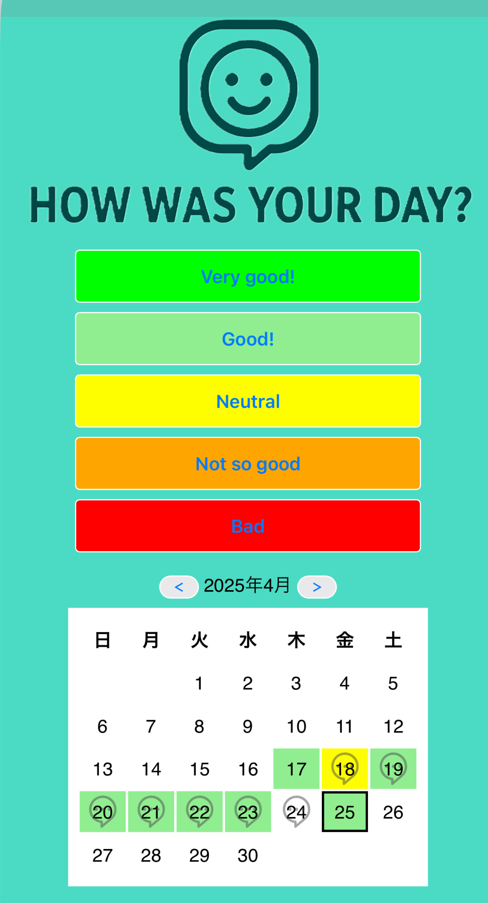
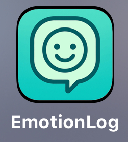

# Emotion Log

**Emotion Log** は、その日の気分を5段階で記録できる感情ログアプリです。  
カレンダーで日ごとの評価を色で表示し、過去の感情の流れを視覚的に振り返ることができます。

## なぜ作ったか

日記を書くことは、その日を振り返る大切な習慣です。
しかし、1日の終わりに文章をしっかり書くのは、忙しい日々の中では手間に感じることもあります。
そこで、もっと気軽に、短時間でその日を振り返れる仕組みを作りたいと思い、このアプリを開発しました。

この「Emotion Log」では、わずか30秒ほどでその日の気分を5段階で記録でき、必要なら一言コメントも追加できます。
また、カレンダー上に色分けされた記録が視覚的に表示されるため、後から見返したときにも感情の流れが一目でわかるようになっています。
忙しい中でも簡単に続けられる、新しい形の日記アプリを目指しました。

## 特徴

- 5段階評価
- 日ごとにひと言コメントができる
- シンプルで使いやすいデザイン
- 日付の切り替えは夜3時（0時を回って記録することがあるため）
- スマホでの使用を想定（ホーム画面に追加すると可愛いアイコンが）

---

## 使い方

1. 今日の気分をボタンで選択  
2. 必要であればカレンダー上の好きな日付をタップしてひと言コメント追加  
3. 毎日続けることで、過去の記録を視覚的に振り返ることができる

---

## 開発・技術

- HTML / CSS / JavaScript
- GitHub Pagesで公開
- LocalStorageにデータ保存（ログイン不要）

---

## スクリーンショット

---

## ライセンス

MIT License
